<!-- Hero Animated Header -->

<!-- Interactive Philosophy Cards -->
<table border="0" style="width: 100%; border-collapse: collapse;">
  <tr>
    <td width="50%" align="center" style="background-color: #0b0f19; border-radius: 12px; padding: 16px;">
      <h3 style="color: #79c0ff;">Interfaces people remember</h3>
      
      
Crafting clean, responsive, high-performance web applications and fluid UI.

    </td>
    <td width="50%" align="center" style="background-color: #0b0f19; border-radius: 12px; padding: 16px;">
      <h3 style="color: #bc8cff;">Healthy body, curious mind</h3>
      
      
Continuous exploration, problem solving, scalable architectures, and disciplined learning.

    </td>
  </tr>
</table>

 

### ✦ Tools I build with

  

 

### ✦ Profile at a glance
<table border="0" style="width: 100%; background: #0d1117; border-radius: 16px; border: 1.5px solid #30363d; padding: 18px;">
  <tr>
    <!-- Lanyard Developer ID Badge -->
    <td width="32%" align="center" style="background: #161b22; border-radius: 12px; border: 1.5px dashed #8957e5; padding: 18px;">
      
       
      <h3 style="color: #f0f6fc; margin: 12px 0 3px 0; font-size: 18px;">Ajeesh</h3>
      <code style="color: #7ee787; font-size: 11px;">● AVAILABLE FOR HIRE</code> 
      Full-Stack &amp; AI Builder
    </td>

    <!-- Developer Overview Metrics -->
    <td width="68%" style="padding-left: 24px;">
      
// DEVELOPER OVERVIEW

      <h2 style="color: #f0f6fc; margin: 4px 0 16px 0; font-size: 22px;">Profile at a glance</h2>

      <table border="0" width="100%">
        <tr>
          <td align="center" style="background: #161b22; border-radius: 8px; border: 1px solid #21262d; padding: 10px;">
            <b style="color: #f0f6fc; font-size: 16px;">@Ajeesh-iv</b> 
            <small style="color: #8b949e;">GitHub Handle</small>
          </td>
          <td align="center" style="background: #161b22; border-radius: 8px; border: 1px solid #21262d; padding: 10px;">
            <b style="color: #7ee787; font-size: 16px;">Active</b> 
            <small style="color: #8b949e;">Status</small>
          </td>
          <td align="center" style="background: #161b22; border-radius: 8px; border: 1px solid #21262d; padding: 10px;">
            <b style="color: #ff79c6; font-size: 16px;">2026</b> 
            <small style="color: #8b949e;">Edition</small>
          </td>
        </tr>
      </table>

      <!-- Animated-style Progress Meters -->
      

        Frontend &amp; Responsive UI
        

          

        

      

      

        Backend, Cloud &amp; Automation
        

          

        

      

    </td>
  </tr>
</table>

 

### ✦ Contributions & Activity

<table border="0">
  <tr>
    <td>
      
    </td>
    <td>
      
    </td>
  </tr>
</table>

<!-- Live Animated Tokyo Night Activity Graph -->

 

---

### Let's build something together ✨
*Open for collaboration, full-stack projects, and technical opportunities.*

 

  

