<!-- Hero Animated Header -->

<!-- Typing Subtitle -->

<!-- Profile Views Badge -->

  

---

<!-- Interactive Philosophy Cards -->
<table border="0" width="100%">
  <tr>
    <td width="50%" align="center" style="background-color: #0b0f19; border-radius: 12px; padding: 16px;">
      <h3 style="color: #79c0ff;">Interfaces people remember</h3>
      
      
Crafting clean, responsive, pixel-perfect web applications and fluid micro-interactions.

    </td>
    <td width="50%" align="center" style="background-color: #0b0f19; border-radius: 12px; padding: 16px;">
      <h3 style="color: #bc8cff;">Healthy body, curious mind</h3>
      
      
Continuous exploration, scalable system designs, problem solving, and disciplined everyday learning.

    </td>
  </tr>
</table>

 

### ✦ Tools I build with

  

 

### ✦ Profile at a glance

  

 

### ✦ Featured Builds

| Project | Description | Stack | Links |
| :--- | :--- | :--- | :---: |
| 🚀 **Full-Stack SaaS Platform** | Cloud dashboard with real-time analytics, user authentication, and responsive controls. | Next.js, TypeScript, Tailwind | [Demo](https://github.com/Ajeesh-iv) • [Code](https://github.com/Ajeesh-iv) |
| ⚡ **Interactive Web Experience** | Award-worthy scroll interactions, smooth canvas visualizers, and state-driven animations. | React, Three.js, GSAP | [Demo](https://github.com/Ajeesh-iv) • [Code](https://github.com/Ajeesh-iv) |
| 🛠️ **API & Automation Engine** | High-concurrency backend service with database pipelines and automated workflows. | Node.js, Express, PostgreSQL | [Demo](https://github.com/Ajeesh-iv) • [Code](https://github.com/Ajeesh-iv) |

 

### ✦ Contributions & Activity

<!-- Dynamic Trophies -->

  

<!-- Stats & Streak Cards -->
<table border="0">
  <tr>
    <td>
      
    </td>
    <td>
      
    </td>
  </tr>
</table>

<!-- Live Animated Activity Graph -->

 

---

### Let's build something together ✨
*Open for full-time frontend/full-stack roles, freelance collaborations, and open-source.*

 

  

> *"Always learning, always building."*

 

